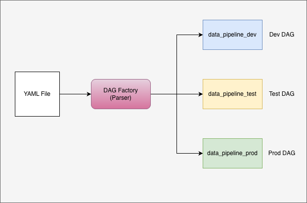

# airflow-dag-factory-multi-environment
Building a Multi-Environment Setup on a Single Airflow Instance Using DAG Factory

# 🚀 Airflow DAG Factory with Multi-Environment Support

This project demonstrates how to dynamically generate Apache Airflow DAGs using **dag-factory**, with support for multiple environments such as **dev**, **test**, and **prod**.

It uses a clean separation of configuration and code, and runs using **Docker Compose without requiring a custom Dockerfile**.

---

## 📌 Features

- Dynamic DAG generation using YAML (dag-factory)
- Multi-environment support (dev / test / prod)
- Environment-driven configuration (no hardcoding)
- Docker Compose setup (no image build required)
- Scalable and clean project structure

---

## ⚙️ How It Works

1. DAG configurations are defined in YAML files
2. A base config is shared across environments
3. Environment-specific configs override the base
4. `dag_factory.py` reads the active environment
5. DAGs are dynamically generated and registered in Airflow

---

## Repository Structure

```
airflow-dag-factory-multi-environment/
├── dags/
│   ├── data_pipeline.py
│   ├── config/
│   │   └── dev.yml
│   │   └── test.yml
│       └── prod.yml
│   ├── utils/
│   │   └── config_manager.py
│   │   └── dag_factory.py
├── docs/
│   ├── dag_factory.png
├── requirements.txt
├── docker-compose.yml
├── Dockerfile
└── README.md
```

---

## 🖼️ Architecture Diagram

> The below diagram illustrates how DAG Factory loads configurations and generates DAGs dynamically across environments.



---

## Prerequisites

- Python 3.10+
- Apache Airflow 2.5+
- `dag-factory` >= 0.19 (see `requirements.txt`)

---

## 🐳 Running the Project
### Start Airflow
`docker-compose up -d`
```
Access Airflow UI
URL: http://localhost:8080
Username: admin
Password: admin
```
---

## ✅ Expected DAGs in UI

After running the project, you should see:

- example_dag_dev
- example_dag_test
- example_dag_prod
